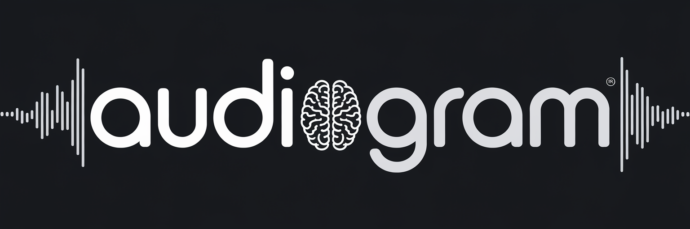
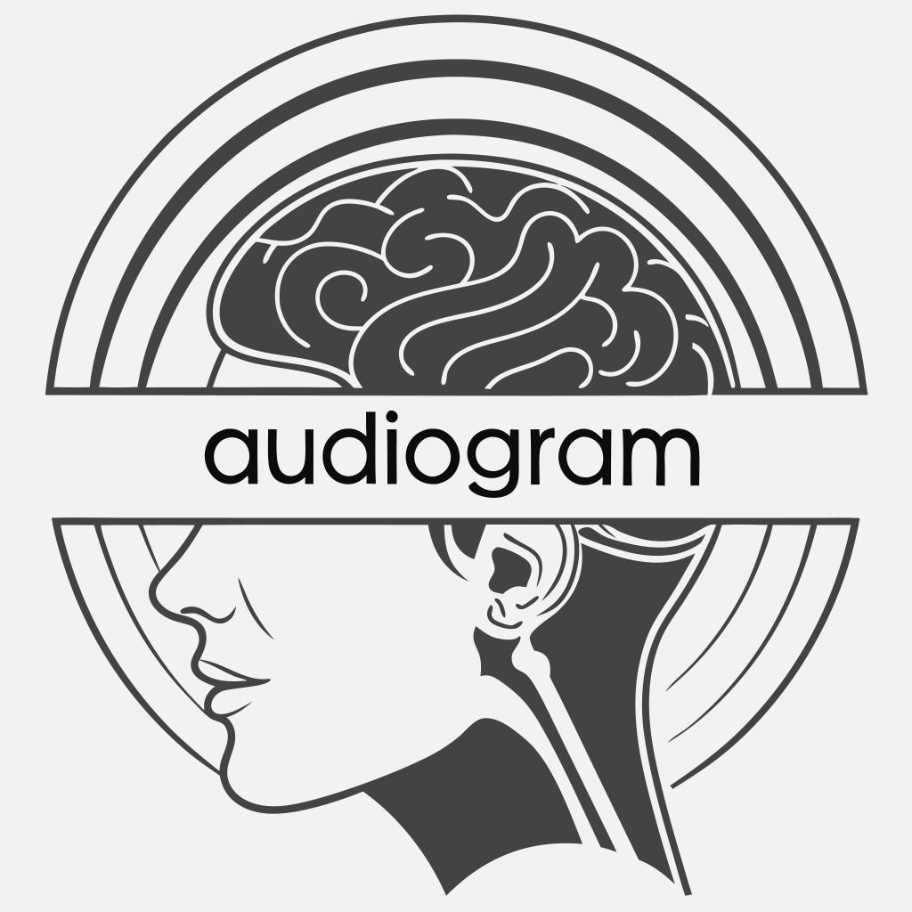

<div align="center">
  
  <h1>audiogram v0.0.1</h1>
  <p>
    
    A web application that analyzes music to visualize how different musical elements might activate regions of the brain.
  </p>
</div>

## Requirements

### Backend
- Python 3.8+
- Flask 2.0.1
- Flask-CORS 3.0.10
- NumPy 1.21.0
- Pandas 1.3.0
- Librosa 0.8.1
- Scikit-learn 0.24.2
- Nibabel 3.2.1
- Nilearn 0.8.1
- Matplotlib 3.4.2
- SciPy 1.7.0
- Requests 2.26.0

### Frontend
- Node.js 14+
- React 18.2.0
- Styled-components 5.3.6
- Axios 1.2.1
- Three.js 0.148.0
- D3.js 7.8.0

## Installation

### Windows Quick Setup

1. Clone the repository:
   ```
   git clone https://github.com/fizt656/audiogram.git
   cd audiogram
   ```

2. Run the setup script:
   ```
   setup.bat
   ```

### Manual Setup

1. Clone the repository:
   ```
   git clone https://github.com/fizt656/audiogram.git
   cd audiogram
   ```

2. Create and activate a Python virtual environment:
   ```
   python -m venv venv
   
   # On Windows
   venv\Scripts\activate
   
   # On macOS/Linux
   source venv/bin/activate
   ```

3. Install Python dependencies:
   ```
   pip install -r requirements.txt
   ```

4. Install frontend dependencies:
   ```
   cd src/frontend
   npm install
   ```

## Usage

### Windows Quick Start

```
run.bat
```

### Manual Start

1. Start the backend server:
   ```
   # Ensure your virtual environment is activated
   cd src/backend
   python app.py
   ```

2. In a separate terminal, start the frontend:
   ```
   cd src/frontend
   npm start
   ```

3. Open your browser to `http://localhost:3000`

## Screenshots

### Main Interface


### Brain Visualization


### Emotion Analysis Results


## Technical Details

### Music Emotion Analysis

The application analyzes music files using the following process:

1. **Audio Feature Extraction**: Uses Librosa to extract musical features including:
   - Tempo (BPM)
   - Spectral features (centroid, bandwidth)
   - Harmonic features (chroma)
   - MFCC features
   - Energy
   - Key and mode estimation (major/minor)

2. **Emotion Mapping**: Maps extracted features to emotion scores:
   - Happy: Associated with fast tempo, major mode, high energy
   - Sad: Associated with slow tempo, minor mode, low energy
   - Calm: Associated with slow tempo, major mode, low energy
   - Energetic: Associated with fast tempo, major mode, high energy
   - Tense: Associated with medium tempo, minor mode, medium energy

3. **Time Segmentation**: Divides the music into segments for time-based emotion analysis

### Brain Visualization

The brain visualization is generated through:

1. **Emotion-to-Brain Mapping**: Each emotion is mapped to specific brain regions based on neuroscience research:
   - Happy: Nucleus accumbens, ventral tegmental area, orbitofrontal cortex
   - Sad: Amygdala, hippocampus, anterior cingulate cortex
   - Calm: Prefrontal cortex, anterior cingulate cortex, hippocampus
   - Energetic: Motor cortex, supplementary motor area, basal ganglia, cerebellum
   - Tense: Amygdala, hypothalamus, periaqueductal gray, anterior insula

2. **MRI Processing**: Uses Nibabel and Nilearn to:
   - Load MNI template brain data
   - Generate axial, coronal, and sagittal slices
   - Create activation overlays based on emotion scores

3. **Visualization**: Renders the brain with activation patterns using:
   - Base64-encoded PNG images for each slice
   - Color-coded overlays representing activation intensity
   - Interactive controls for exploring different brain regions

## Project Structure

```
audiogram/
├── src/
│   ├── frontend/           # React frontend application
│   │   ├── public/         # Static assets
│   │   └── src/
│   │       ├── components/ # React components
│   │       ├── styles/     # CSS styles
│   │       └── assets/     # Images and other assets
│   │
│   ├── backend/            # Python Flask backend
│   │   ├── api/            # API endpoints and processing modules
│   │   │   ├── music_analysis.py  # Audio analysis
│   │   │   ├── brain_mapping.py   # Emotion-to-brain mapping
│   │   │   └── mri_processing.py  # MRI visualization
│   │   └── app.py          # Flask application
│   │
│   └── data/               # Data files and resources
│       └── brain_regions.json  # Brain region information
│
├── setup.bat               # Windows setup script
├── run.bat                 # Windows run script
├── requirements.txt        # Python dependencies
└── LICENSE                 # MIT License with Commercial Use Restriction
```

## License

This project is licensed under the MIT License with Commercial Use Restriction - see the [LICENSE](LICENSE) file for details.
